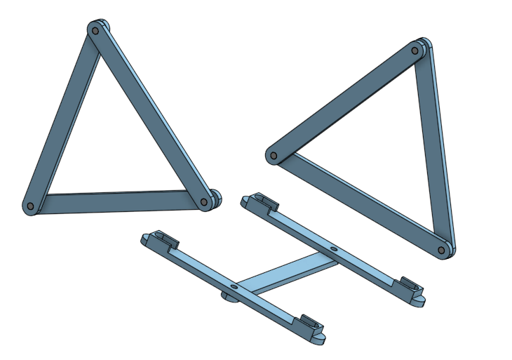
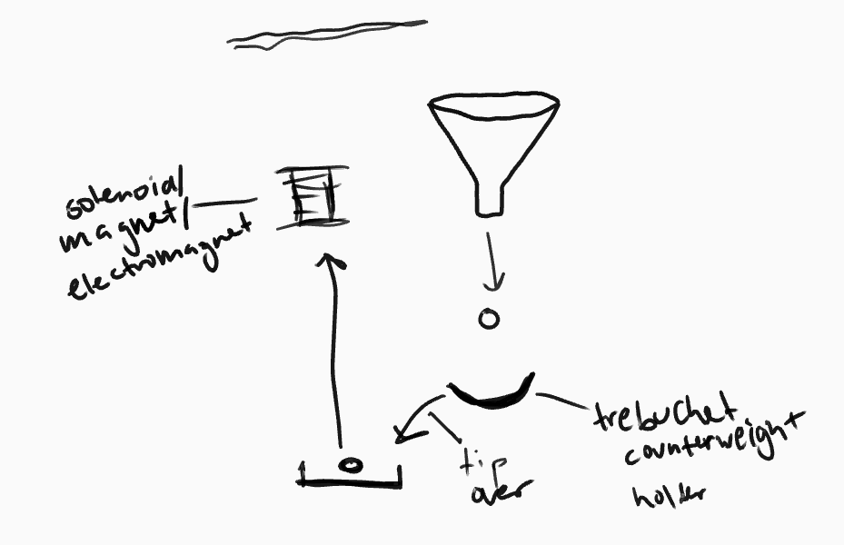
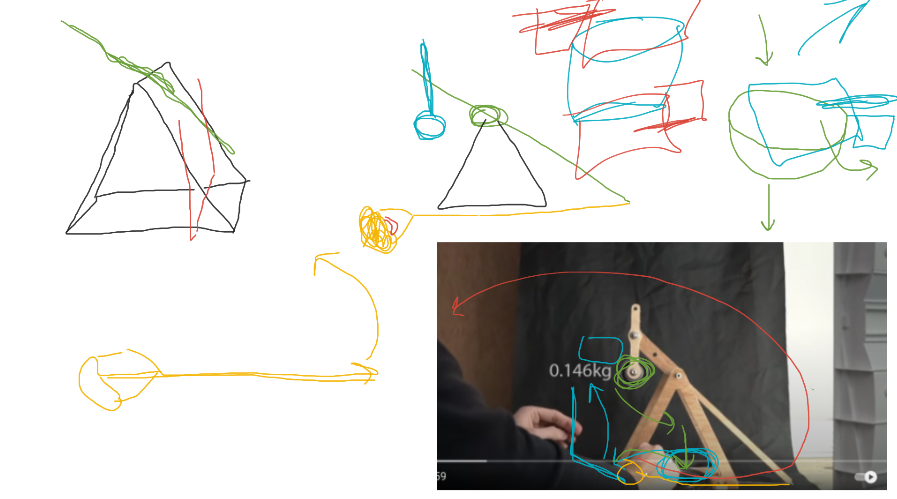
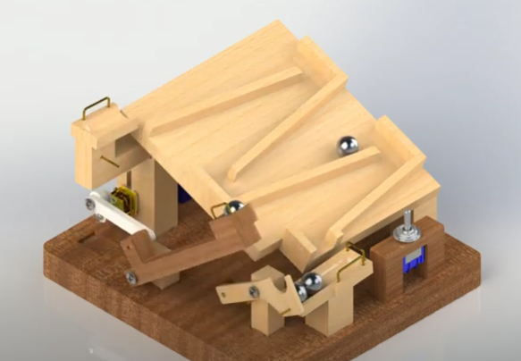
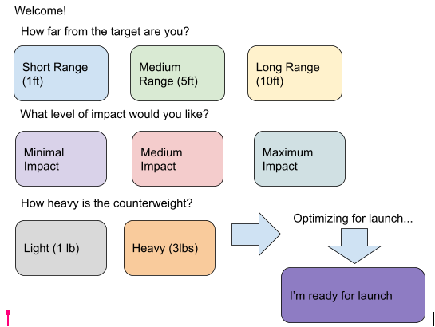
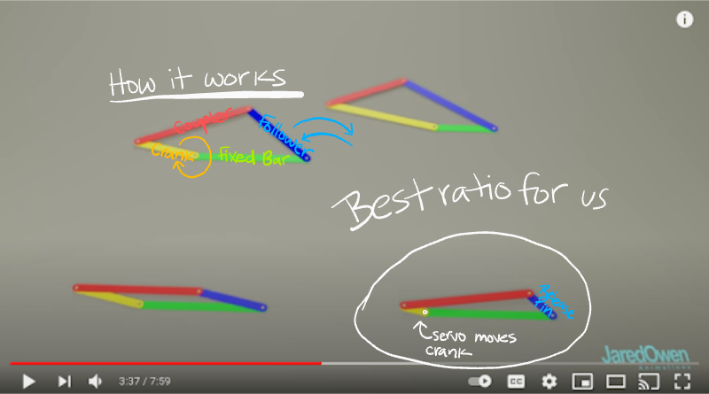

# Pi Trebuchet
Elisabeth Scharf and Abigail Paquette

[Trello Board](https://trello.com/b/15McbNyB/engineering-4-project)

[Calendar](https://jamboard.google.com/d/1JnHUE4IZWikT05Q0Ya0kpPUMJIv1QDpOZKAwVSAdiaQ/edit?usp=sharing) 

[Possible Release Pin Mechanism (3:06 to 3:40) ](https://www.youtube.com/watch?v=BVnrD9m3nSI&t=185s)

## Table of Contents

[Preliminary Brainstorming](https://github.com/Apaquet37/PiTrebuchet/blob/main/README.md#Brainstorming)

[Planning](https://github.com/Apaquet37/PiTrebuchet/blob/main/README.md#planning)

[Prototyping and Initial Designs](https://github.com/Apaquet37/PiTrebuchet/blob/main/README.md#prototyping-and-initial-designs)

[Schedule and Milestones](https://github.com/Apaquet37/PiTrebuchet/blob/main/README.md#schedule-and-milestones-see-trello-board-for-more-specific-tasks)

## Brainstorming
For Engineering 4, we have to create a project that uses the raspberry pi in some way. The typical project is pi in the sky, where you find some way to launch or levitate your pi into the sky, but we are not being held to those constraints this year. Here are some of the initial ideas we thought about:
```
- Launch pi into air and take measurements/pictures 
- Infrared power outage people sensor 
- Launch pi on a rocket and track and create a graphic of its motion
    - User interface 
    - Picture button
    - Math and data
- Vertical panorama
```
And here are some of the materials we have at our disposal:
```
Sensors/sources of input we have:
- Camera 
- Barometric pressure, altimeter, temperature
- Accelerometer and magnetometer
- Infrared 
```
We decided we like the Pi in the Sky idea, and defined the problem as having two broad possible solutions:
```
Two ideas:
1. Pi is launched externally and there is a user interface that displays and saves data/photos
2. Pi somehow keeps itself up and user interface functions as a controller
```
We liked option number two, and fleshed that out even more:
```
Ways to get pi in the air:
- Rocket
    - Combustible engine
    - Pressure powered (water, stomp)
- Catapult
    - Trebuchet
```
Before deciding to delve into the world of trebuchets.


## Planning

**Goal:** Create the most automated whipper trebuchet possible. [What is a whipper trebuchet?](https://www.youtube.com/watch?v=-gn2RGPqe_A&t=793s)

**Overview:**

How does a whipper trebuchet work?

Parts of a trebuchet


Launch process


Tasks usually completed by a human:

- Put in place the counterweight
- Load the sling with the projectile
- Set the launch angle 
- Pull the release pin 

Tasks we would like automate:

- Setting the launch angle 


- Pulling the release pin
  - Remote launch user interface
  - Pi's Flask webpage 
- Maybe:
  - Changing the weight in the counterweight

Constraints:

- It will be extremely difficult to reset the string on the trebuchet because the string will get caught
- Both emptying and refilling the counterweight would be extremely challenging
  - We have figured out how to lift marbles (which would be the weights) from the base of the treubuchet to the counterweight arm
  - The challenge is creating a container that can swing around without launching marbles, but be easily accessible for us to empty and refill according to the appropriate weight for the desired launch distance


**Vision/Description:** We are going to launch an object using a trebuchet we have designed. We will create a user interface that allows the user to input two main pieces of data: how far the trebuchet is from the target, and relatively how much force with which they would like for the projectile to hit the target. The Pi does the calculation and changes the launch angle to help acheive the desired outcome. Once the launch has been optimized, the user can press a button that will tell the Pi to release a pin and launch the object. The object whips around and flies through the air to hit the target. Then the Pi resets the launch angle and lets the user know that the trebuchet is ready to be reset. 

## Prototyping and Initial Designs
     

**User Interface**



**Release Pin Mechanism Ideas:**



**Engineering Process:**
- [x] Identify problem or goal 
- [x] Identify resources and constraints
- [x] Brainstorm ideas
- [x] Pick a solution
- [x] Develop an initial design (pencil and paper, CAD, etc.)
- [ ] Construct a prototype
- [ ] Test your design
- [ ] Refine/optimize your design
- [ ] Present finished product 


## Schedule and Milestones (See Trello board for more specific tasks)

|Week|Elisabeth's Task|   Abby's Task   |Accomplished|Plans to catch up (if needed)|
|----|----------------|-----------------|------------|-----------------------------|
|March 8-12|Submit proposal and design parts for release pin|Submit proposal and finish pi assignments from beginning of year|
|March 15-19|Design release pin mechanism|
|March 22-26|Build the trebuchet base|
|March 29 - April 2|Begin work on the sling|
|Spring Break|
|April 12-16|Design and assemble counterweight|
|April 19-23|Continue on counterweight and sling work|
|April 26-30|Testing, troubleshooting, and revising|
|May 3-7|Testing, troubleshooting, and revising|
|May 10-14|Testing, troubleshooting, and revising|
|May 17-21|Finalize everything and finish documentation|
