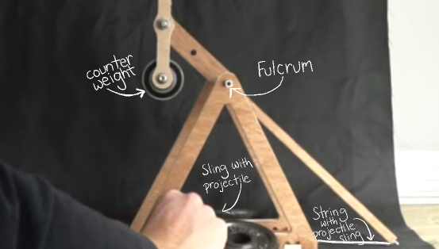
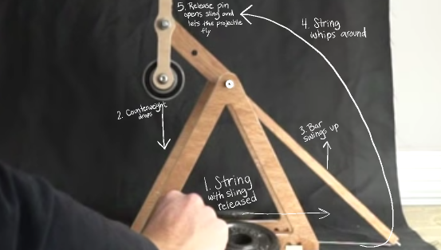
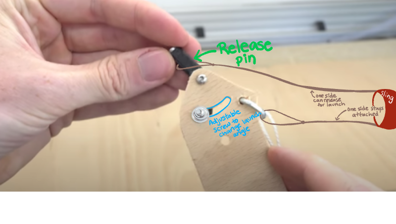

# Pi Trebuchet
Elisabeth Scharf and Abigail Paquette

[Trello Board](https://trello.com/b/15McbNyB/engineering-4-project)

[Calendar](https://jamboard.google.com/d/1JnHUE4IZWikT05Q0Ya0kpPUMJIv1QDpOZKAwVSAdiaQ/edit?usp=sharing) 

## Planning ##

**Goal:** Create the most automated whipper trebuchet possible. [What is a whipper trebuchet?](https://www.youtube.com/watch?v=-gn2RGPqe_A&t=793s)

**Overview:**

How does a whipper trebuchet work?

Parts of a trebuchet

Launch process

Tasks usually completed by a human:

- Put in place the counterweight
- Load the sling with the projectile
- Set the launch angle 
- Pull the release pin 

Tasks we would like automate:

- Setting the launch angle 

- Pulling the release pin
  - Remote launch user interface
  - Pi's Flask webpage 
- Maybe:
  - Changing the weight in the counterweight

Constraints:

- It will be extremely difficult to reset the string on the trebuchet because the string will get caught
- Both emptying and refilling the counterweight would be extremely challenging
  - We have figured out how to lift marbles (which would be the weights) from the base of the treubuchet to the counterweight arm
  - The challenge is creating a container that can swing around without launching marbles, but be easily accessible for us to empty and refill according to the appropriate weight for the desired launch distance

**Vision/Description:** We are going to launch an object using a trebuchet we have designed. We will create a user interface that allows the user to input two main pieces of data: how far the trebuchet is from the target, and relatively how much force with which they would like for the projectile to hit the target. The Pi does the calculation and changes the launch angle to help acheive the desired outcome. Once the launch has been optimized, the user can press a button that will tell the Pi to release a pin and launch the object. The object whips around and flies through the air to hit the target. Then the Pi resets the launch angle and lets the user know that the trebuchet is ready to be reset. 

**Engineering Process:**
- [x] Identify problem or goal 
- [ ] Identify resources and constraints
- [ ] Brainstorm ideas
- [ ] Pick a solution
- [ ] Develop an initial design (pencil and paper, CAD, etc.)
- [ ] Construct a prototype
- [ ] Test your design
- [ ] Refine/optimize your design
- [ ] Present finished product 
