# Pi Trebuchet :) This is our project YAY  TEST test TEST
Elisabeth Scharf and Abigail Paquette

[Trello Board](https://trello.com/b/15McbNyB/engineering-4-project)

[Calendar](https://jamboard.google.com/d/1JnHUE4IZWikT05Q0Ya0kpPUMJIv1QDpOZKAwVSAdiaQ/edit?usp=sharing) 


## Table of Contents

[Preliminary Brainstorming](https://github.com/Apaquet37/PiTrebuchet/blob/main/README.md#Brainstorming)

[Planning](https://github.com/Apaquet37/PiTrebuchet/blob/main/README.md#planning)

[Prototyping and Initial Designs](https://github.com/Apaquet37/PiTrebuchet/blob/main/README.md#prototyping-and-initial-designs)

[Schedule and Milestones](https://github.com/Apaquet37/PiTrebuchet/blob/main/README.md#schedule-and-milestones-see-trello-board-for-more-specific-tasks)

## Brainstorming
For Engineering 4, we have to create a project that uses the raspberry pi in some way. The typical project is pi in the sky, where you find some way to launch or levitate your pi into the sky, but we are not being held to those constraints this year. Here are some of the initial ideas we thought about:
```
- Launch pi into air and take measurements/pictures 
- Infrared power outage people sensor 
- Launch pi on a rocket and track and create a graphic of its motion
    - User interface 
    - Picture button
    - Math and data
- Vertical panorama
```
And here are some of the materials we have at our disposal:
```
Sensors/sources of input we have:
- Camera 
- Barometric pressure, altimeter, temperature
- Accelerometer and magnetometer
- Infrared 
```
We decided we like the Pi in the Sky idea, and defined the problem as having two broad possible solutions:
```
Two ideas:
1. Pi is launched externally and there is a user interface that displays and saves data/photos
2. Pi somehow keeps itself up and user interface functions as a controller
```
We liked option number two, and fleshed that out even more:
```
Ways to get pi in the air:
- Rocket
    - Combustible engine
    - Pressure powered (water, stomp)
- Catapult
    - Trebuchet
```
Before deciding to delve into the world of trebuchets.


## Planning

**Goal:** Create the most automated whipper trebuchet possible. [What is a whipper trebuchet?](https://www.youtube.com/watch?v=-gn2RGPqe_A&t=793s)

**Overview:**

How does a whipper trebuchet work?

Parts of a trebuchet


Launch process


Tasks usually completed by a human:

- Put in place the counterweight
- Load the sling with the projectile
- Set the launch angle 
- Pull the release pin 

Tasks we would like automate:

- Setting the launch angle 


- Pulling the release pin
  - Remote launch user interface
  - Pi's Flask webpage 
- Maybe:
  - Changing the weight in the counterweight

Constraints:

- It will be extremely difficult to reset the string on the trebuchet because the string will get caught
- Both emptying and refilling the counterweight would be extremely challenging
  - We have figured out how to lift marbles (which would be the weights) from the base of the treubuchet to the counterweight arm
  - The challenge is creating a container that can swing around without launching marbles, but be easily accessible for us to empty and refill according to the appropriate weight for the desired launch distance


**Vision/Description:** We are going to launch an object using a trebuchet we have designed. We will create a user interface that allows the user to input two main pieces of data: how far the trebuchet is from the target, and relatively how much force with which they would like for the projectile to hit the target. The Pi does the calculation and changes the launch angle to help acheive the desired outcome. Once the launch has been optimized, the user can press a button that will tell the Pi to release a pin and launch the object. The object whips around and flies through the air to hit the target. Then the Pi resets the launch angle and lets the user know that the trebuchet is ready to be reset. 

## Prototyping and Initial Designs
     

**User Interface**


**Release Pin Mechanism Ideas:**


[Possible Release Pin Mechanism (3:06 to 3:40) ](https://www.youtube.com/watch?v=BVnrD9m3nSI&t=185s)


**Engineering Process:**
- [x] Identify problem or goal 
- [x] Identify resources and constraints
- [x] Brainstorm ideas
- [x] Pick a solution
- [x] Develop an initial design (pencil and paper, CAD, etc.)
- [x] Construct a prototype
- [x] Test your design
- [ ] Refine/optimize your design
- [ ] Present finished product 


## Schedule and Milestones (See Trello board for more specific tasks)

**Initial Calendar** 

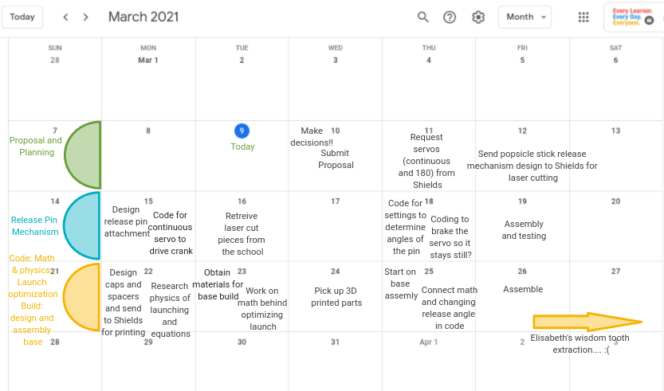 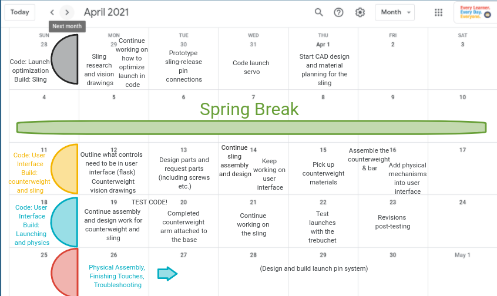 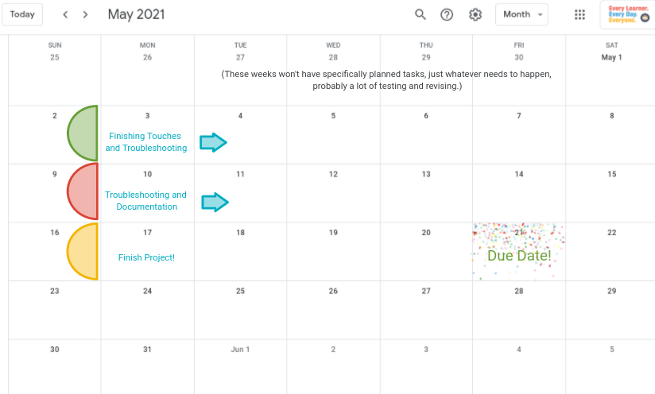

**Milestones**

|Week|Elisabeth's Task|   Abby's Task   |Accomplished|Plans to catch up (if needed)|
|----|----------------|-----------------|------------|-----------------------------|
|March 8-12|Submit proposal and design parts for release pin|Submit proposal and finish pi assignments from beginning of year|Our proposal was submitted midweek, and we are starting to work in earnest on our project. The parts for the release pin mechanism were submitted Friday, and Abby will complete her pi assignments over the weekend.|Do pi assignments over the weekend.|
|March 15-19|Design release pin mechanism|Code release pin mechanism servo|One iteration of the release pin mechanism has been designed and lasercut, but scale was a bit off and testing still has to be done. The code for the servo has been started, but it also still needs to be worked on.|We are just going to continue to work hard and make sure to utilize time outside of class.|
|March 22-26|Build the trebuchet base|Research the math and physics behind the launch, work with the equations to optimize launch by changing release angle|
|March 29 - April 2|Begin work on the sling|Implement launch optimization in code (with release pin servo) and code launch servo|
|Spring Break| N/A | N/A |
|April 12-16|Design and assemble counterweight|Start working on flask user interface|
|April 19-23|Continue on counterweight and sling work|Add physical mechanisms into user interface, test and troubleshoot user interface|
|April 26-30|Designing and building the launch pin system|Testing, troubleshooting, and revising|
|May 3-7|Testing, troubleshooting, and revising|Testing, troubleshooting, and revising|
|May 10-14|Testing, troubleshooting, and revising|Testing, troubleshooting, and revising|
|May 17-21|Finalize everything and finish documentation|Finalize everything and finish documentation|


## Documentation: ## 

**Little lessons along the way**

E: In the midst of trying to sort through some mates to find an error, I realized that things would be so much easier if I had named my mates. 
Making that change has been helpful and has allowed me to troubleshoot more easily, especially as I add more and more pieces and more and more mates. 

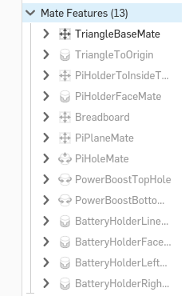


Challenges we faced:
- Using the sheet metal tool to simulate bent acrylic
  - Learning how to do that in Onshape
  - Getting help from Dr. Shields
  - Editing the model
- Using a heat gun to bend acrylic 
  - Abby's experience doing that for the first time
  - Using a wooden block as a mold
- Designing an axle to stablize the arm
  - Design challenge: we had to be able to put the arm onto the axle, but also make sure that once it was on it would not shift from side to side 
  - Two-piece design solution
  - Creating a headless screw
  - Friction reduction: sanding and dry lubrication with graphite 
- Designing a mechanized moving pin
  - Finding a design
  - Replicating it in Onshape
  - Assembling it all in Onshape
  - Scale for dxf files... (lesson learned)
  - Current photos
- Correlating the servo values (-1 to 1) with the release pin angles (0-180deg) and omega (rad)
  - Protractor photo
  - Screenshot of the graph to find the relationship
- All the math... 
  - Energy & kinematics
  - New formula for omega
  - Adjustments to the new omega formula


##### Design #####

There were a few distinct aspects of the design:
1. PiHolder
2. Custom Axle
3. Arm
4. Release Pin Mechanism 

** 1. PiHolder ** 

The PiHolder presented a unique challenge because we planned on lasercutting the design first and then bending the acrylic afterwards. 

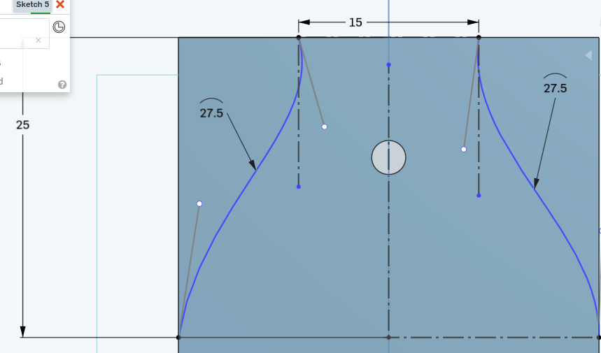
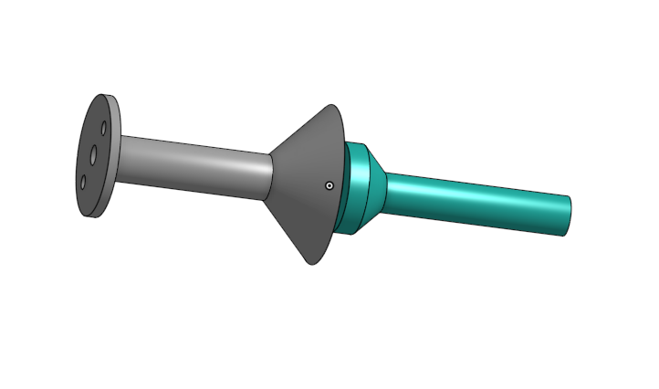
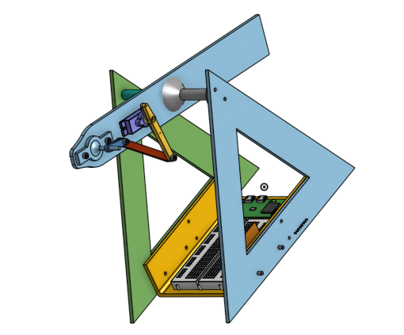
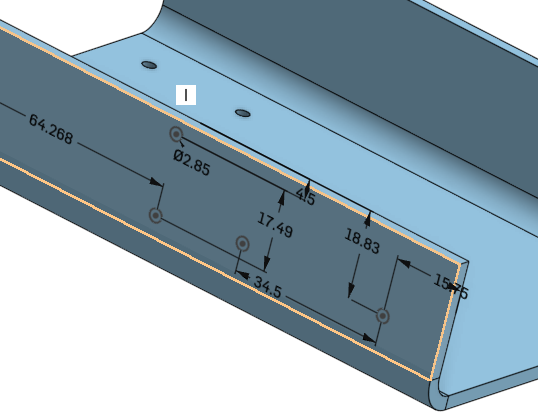
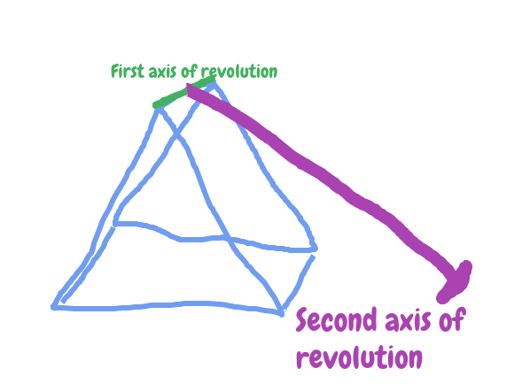

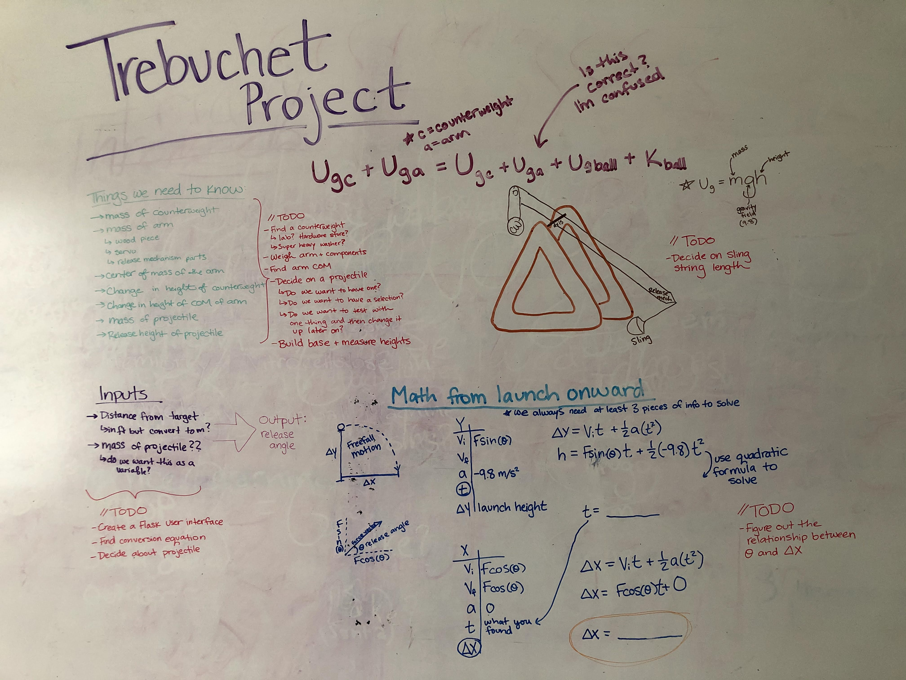
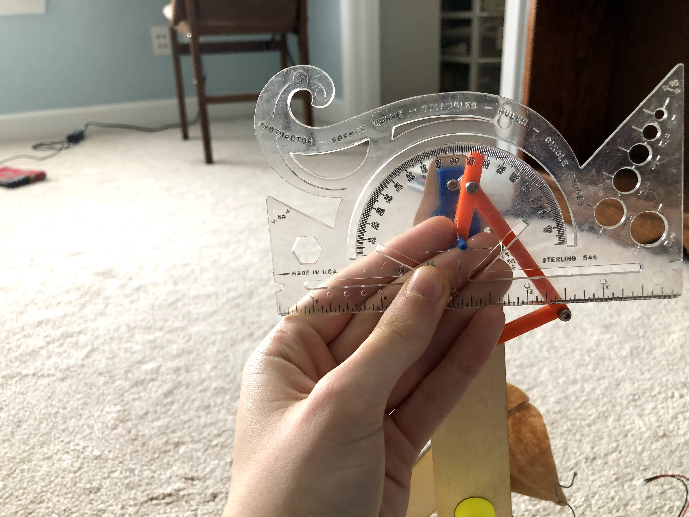
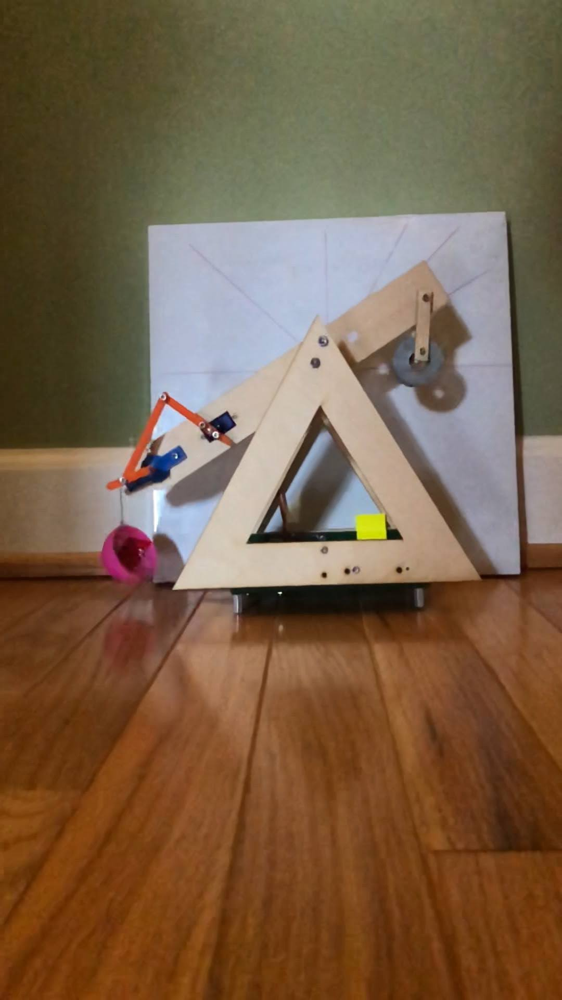
