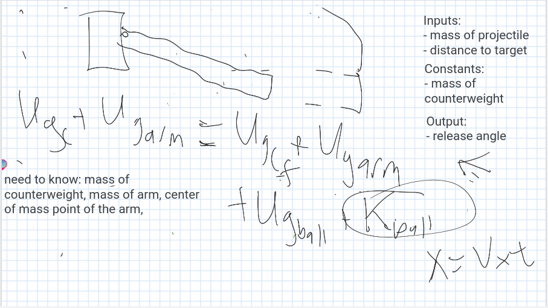

# Pi Trebuchet
Elisabeth Scharf and Abigail Paquette - Engineering 4 Repo & Documentation

[Trello Board](https://trello.com/b/15McbNyB/engineering-4-project)

[Calendar](https://jamboard.google.com/d/1JnHUE4IZWikT05Q0Ya0kpPUMJIv1QDpOZKAwVSAdiaQ/edit?usp=sharing) 

[Onshape Document](https://cvilleschools.onshape.com/documents/231c459fbc6840d3f00a1b9f/w/e7df1ab6ccf7a00b59ac0257/e/ae8347c1ef2b746ac703c727)


## Table of Contents

[Preliminary Brainstorming](https://github.com/Apaquet37/PiTrebuchet/blob/main/README.md#Brainstorming)

[Planning](https://github.com/Apaquet37/PiTrebuchet/blob/main/README.md#planning)

[Prototyping and Initial Designs](https://github.com/Apaquet37/PiTrebuchet/blob/main/README.md#prototyping-and-initial-designs)

[Schedule and Milestones](https://github.com/Apaquet37/PiTrebuchet/blob/main/README.md#schedule-and-milestones-see-trello-board-for-more-specific-tasks)

[Documentation](https://github.com/Apaquet37/PiTrebuchet/blob/main/README.md#documentation)

[Design](https://github.com/Apaquet37/PiTrebuchet/blob/main/README.md#design)

[Code](https://github.com/Apaquet37/PiTrebuchet/blob/main/README.md#code)

[Math and Physics](https://github.com/Apaquet37/PiTrebuchet/blob/main/README.md#math-and-physics)

## Brainstorming
For Engineering 4, we have to create a project that uses the raspberry pi in some way. The typical project is pi in the sky, where you find some way to launch or levitate your pi into the sky, but we are not being held to those constraints this year. Here are some of the initial ideas we thought about:
```
- Launch pi into air and take measurements/pictures 
- Infrared power outage people sensor 
- Launch pi on a rocket and track and create a graphic of its motion
    - User interface 
    - Picture button
    - Math and data
- Vertical panorama
```
And here are some of the materials we have at our disposal:
```
Sensors/sources of input we have:
- Camera 
- Barometric pressure, altimeter, temperature
- Accelerometer and magnetometer
- Infrared 
```
We decided we like the Pi in the Sky idea, and defined the problem as having two broad possible solutions:
```
Two ideas:
1. Pi is launched externally and there is a user interface that displays and saves data/photos
2. Pi somehow keeps itself up and user interface functions as a controller
```
We liked option number two, and fleshed that out even more:
```
Ways to get pi in the air:
- Rocket
    - Combustible engine
    - Pressure powered (water, stomp)
- Catapult
    - Trebuchet
```
Before deciding to delve into the world of trebuchets.


## Planning

**Goal:** Create the most automated whipper trebuchet possible. [What is a whipper trebuchet?](https://www.youtube.com/watch?v=-gn2RGPqe_A&t=793s)

**Overview:**

How does a whipper trebuchet work?

Parts of a trebuchet


Launch process


Tasks usually completed by a human:

- Put in place the counterweight
- Load the sling with the projectile
- Set the launch angle 
- Pull the release pin 

Tasks we would like automate:

- Setting the launch angle 


- Pulling the release pin
  - Remote launch user interface
  - Pi's Flask webpage 
- Maybe:
  - Changing the weight in the counterweight

Constraints:

- It will be extremely difficult to reset the string on the trebuchet because the string will get caught
- Both emptying and refilling the counterweight would be extremely challenging
  - We have figured out how to lift marbles (which would be the weights) from the base of the treubuchet to the counterweight arm
  - The challenge is creating a container that can swing around without launching marbles, but be easily accessible for us to empty and refill according to the appropriate weight for the desired launch distance


**Vision/Description:** We are going to launch an object using a trebuchet we have designed. We will create a user interface that allows the user to input two main pieces of data: how far the trebuchet is from the target, and relatively how much force with which they would like for the projectile to hit the target. The Pi does the calculation and changes the launch angle to help acheive the desired outcome. Once the launch has been optimized, the user can press a button that will tell the Pi to release a pin and launch the object. The object whips around and flies through the air to hit the target. Then the Pi resets the launch angle and lets the user know that the trebuchet is ready to be reset. 

## Prototyping and Initial Designs
     

**User Interface**


**Release Pin Mechanism Ideas:**


[Possible Release Pin Mechanism (3:06 to 3:40) ](https://www.youtube.com/watch?v=BVnrD9m3nSI&t=185s)


**Engineering Process:**
- [x] Identify problem or goal 
- [x] Identify resources and constraints
- [x] Brainstorm ideas
- [x] Pick a solution
- [x] Develop an initial design (pencil and paper, CAD, etc.)
- [x] Construct a prototype
- [x] Test your design
- [ ] Refine/optimize your design
- [ ] Present finished product 


## Schedule and Milestones (See Trello board for more specific tasks)

**Initial Calendar** 

  

**Milestones**

|Week|Elisabeth's Task|   Abby's Task   |Accomplished|Plans to catch up (if needed)|
|----|----------------|-----------------|------------|-----------------------------|
|March 8-12|Submit proposal and design parts for release pin|Submit proposal and finish pi assignments from beginning of year|Our proposal was submitted midweek, and we are starting to work in earnest on our project. The parts for the release pin mechanism were submitted Friday, and Abby will complete her pi assignments over the weekend.|Do pi assignments over the weekend.|
|March 15-19|Design release pin mechanism|Code release pin mechanism servo|One iteration of the release pin mechanism has been designed and lasercut, but scale was a bit off and testing still has to be done. The code for the servo has been started, but it also still needs to be worked on.|We are just going to continue to work hard and make sure to utilize time outside of class.|
|March 22-26|Build the trebuchet base|Research the math and physics behind the launch, work with the equations to optimize launch by changing release angle|The base went through several conceptual iterations, but we ended up going with a lasercut one comprised of two triangles that were connected by a u-shaped channel (made of bent acrylic) that would hold the Pi. The two biggest challenges with this (which continued into future weeks) were creating a two-piece axle to connect the tops of the triangles and learning how to design in 2D for something that would later be 3 dimensional. The code got off to a slower start than intended, but this time was spent trying to make servos work.|
|March 29 - April 2|Begin work on the sling|Implement launch optimization in code (with release pin servo) and code launch servo|Work on the sling did not begin until over a month later. During this time I was still working on parts of the base as well as a lot of the release pin mechanism-related parts. The release pin mechanism took the longest of all the build components, and we wanted to get that part up and running first because it involved both code and build and was the most challenging but also the most crucial system on the trebuchet. More work on programming the servos.|
|Spring Break| N/A | N/A |
|April 12-16|Design and assemble counterweight|Start working on flask user interface|As mentioned before, as we went along we decided to switch up the order in which we worked on particular tasks. For build we prioritized the release pin mechanism and the base, and for code we prioritized getting all of the math code up and running. (See the section below titled **math and physics** to see that whole process...)|
|April 19-23|Continue on counterweight and sling work|Add physical mechanisms into user interface, test and troubleshoot user interface|Again, we decided to prioritize the math and servo (release mechanism)- related code and that, as should have been expected, took much longer *than* expected. :) It took us a while to decide how we wanted to do the counterweight. The goal was to have a relatively heavy counterweight and to lift it as high as we could initially in order to maximize our overall energy budget. (Gravitational potential energy = m*g*h :  we can't change the force of gravity, but we can change the mass and the height)|
|April 26-30|Designing and building the launch pin system|Testing, troubleshooting, and revising|The math and physics behind this project proved to be quite a challenge, but an excellent learning experience nonetheless. As we talked with our engineering and physics teachers, we continued to change our process and to do our best to account for all the variable we could. On the code side we also kept programming whatever new math and physics knowledge we got during the week.|
|May 3-7|Testing, troubleshooting, and revising|Testing, troubleshooting, and revising| The counterweight system ended up being on a hinge, which allowed us to maximize delta h (overall change in height) which increased our energy budget slightly. (See below for a description of the counterweight design & build process) This week was full of code breakthroughs, with getting the servos to be controlled easily and smoothly with gpiozero and coding the range equation so we could actually get theta without having way too many unknowns (although this gave us weird values and we ended up getting rid of it).|
|May 10-14|Testing, troubleshooting, and revising|Testing, troubleshooting, and revising|These last few weeks had the same goal, but resulted in a lot of different types of tasks. We bent acrylic with a heat gun, launched bouncy balls left and right (and sometimes backwards), took lots of slow-mo videos, and continually tweaked the trebuchet and the code. This week some time was spent playing around with Flask and figuring out how to: 1. Control a servo with a button on Flask, and 2. How to take user inputs (make a form) with Flask. We also found "i", the moment of inertia this week.|
|May 17-21|^ See above| ^^ | Another week of continued frustration, bouncy balls everywhere, and little tweaks to see if we could fix the problems we were facing. This is the mundane, tiring part of engineering, but it is what gets you to a final product that is incredible! This week in code, I figured out how to control the servo and send it to a specific angle (on a scale from -1 to 1) which was a big accomplishment. I also experimented with a homemade button to control a servo.| 
|May 24-28| ^^ | ^^ |We ran a test of the math code to compare it with some experimental data we had, and found that the code was giving us *extremely* tiny values for theta, which alerted us to the fact that something was off with our calculations. We discovered that it was because we had forgotten to adjust one of the formulas we were using to fit circumstances slightly different that what it was designed for. Dr. Shields helped us out a lot in that regard, helping us to create an adjusted formula that yielded reasonable values for theta. (Thank you Dr. Shields!!) The math code was updated accordingly for this new equation, and we are now getting realistic values for theta. At this point, the math is basically done, we just need to figure out the relationship between the theta we get from the code, the angle of the realease pin, and the angle of the servo.| 
|May 31-June 4|Testing, working with the sling, troubleshooting|Working on flask code| We found slow-mo videos to be **EXTREMELY** helpful in this process. I was struggling and feeling super frustrated that the trebuchet was not launching, and assumed that it just wasn't going fast enough to launch the projectile properly. However, a slow-mo video revealed that the issue was not speed at all, but the length of the string that connected the sling to the arm. The sling started out with plenty of velocity, but partway through the rotation it was jerked slideways by the arm, cutting short its motion and causing the projectile to fall. Slow-mo proved the best way to diagnose the issues (what was *actually* happening, not what we assumed was going on) and then move forward with the revision process. (Pro tip: fixing an issue goes much more smoothly if you actually know what the issue is. It is worth the time to figure out the problem before you start trying to solve it. ;) Played around a bit with flask on the code side, not much success. The big thing this week on the code side was figuring out the relationship between the angle of the release pin and the value of the servo (-1 to 1).|
|June 7-June 11|Documentation!|Documentation!|This was the last week of school, and it was very hectic with end of year assignments and AP exams. This week we looked back on our project and reflected on how much of what we set out to do we accomplished. We focused on making sure our github readme (what you're reading right now!) was completely up to date and that we had documented everything|End of the year!|


## Documentation: ## 

**Little lessons along the way**

E: In the midst of trying to sort through some mates to find an error, I realized that things would be so much easier if I had named my mates. 
Making that change has been helpful and has allowed me to troubleshoot more easily, especially as I add more and more pieces and more and more mates. 


E: Another tip for Onshape organization is to create folders to organize your part studios and assemblies within a single document. As we added more and more parts, it became challenging to scroll and find each particular part. I ended up with six folders and some sub-folders that told me where to go when looking for specific parts related to the different mechanisms on the trebuchet. 


E: **BIGGEST TIP!** After some trouble with drawings in Onshape (and some issues with scale of laser-cut pieces) Dr. Shields shared with me the CHS Drawing Template. It simplifies the process of creating a document in Onshape and ensures that your pieces won't be off by a factor of 10 (or more). I would highly recommend using this template. (Thank you Dr. Shields!!)

 

**Challenges we faced:**
- Hybrid-model engineering
  - This model required purposeful communication and coordination 
  - It proved challenging because only one of us was in the lab at a time
- Using the sheet metal tool to simulate bent acrylic
  - Learning how to do that in Onshape
  - Getting help from Dr. Shields
  - Editing the model
- Using a heat gun to bend acrylic 
  - Abby's experience doing that for the first time
  - Using a wooden block as a mold

- Designing a mechanized moving pin
  - Finding a design
  - Replicating it in Onshape
  - Assembling it all in Onshape
  - Scale for dxf files... (lesson learned)
  - Current photos
- Correlating the servo values (-1 to 1) with the release pin angles (0-180deg) and omega (rad)
  - Protractor photo
  - Screenshot of the graph to find the relationship
- All the math... 
  - Energy & kinematics
  - New formula for omega
  - Adjustments to the new omega formula


## Design ##

There were a few distinct aspects of the design:
1. PiHolder
2. Custom Axle
3. Arm
4. Release Pin Mechanism 
5. Counterweight
6. Sling 

**1. PiHolder** 

The PiHolder presented a unique challenge because we planned on lasercutting the design first and then bending the acrylic afterwards. It is challenging to design something in 2D when it will end up being 3 dimensional. Onshape has a cool fearure called Sheet Metal that allows you to design in 3D and then "flatten" your design for cutting. Dr. Shields was super helpful with this-exploring this feature and then giving us a template that we used to create our PiHolder. To bend the acrylic precisely, Abby used a piece of wood with the proper width, and the piece turned out great! The blue lines (as seen in the image below) served as guidelines during this process.


**2. Custom Axle**

  - **Design challenge:** we had to be able to put the arm onto the axle, but also make sure that once it was on it would not shift from side to side. 
  - **Thought Process:** We only wanted rotational movement in one plane, but couldn't think how to effectively create walls on each side of the arm that would go on after the arm. We decided that the best plan would be to create a two-piece axle that would connect in the middle after the arm was already on. 
  - **Two-piece design solution:** The product was a two-piece axle where each side connected to one of the triangular walls and had a cone shape on the other end (specially designed to limit support material - just for you Dr. Shields!). The plan was to slide the arm onto a little part that stuck out from one of the sides and then to attach the two parts with a deeply countersunk screw. 
  - **Revisions:** Once we saw the printed parts, we realized that countersunk screws would not be feasible. We decided instead to improvise and create a headless screw. (This proved an entertaining process.) As we were testing the arm on the axle, we realized that there was a significant amount of friction, which was less than ideal. To combat that challenge we sanded the wood to remove any splinters and used liquid graphite (a dry lubricant) on the axle to reduce friction between the axle and the arm. 


**3. Arm**

The arm, in and of itself, was not a complicated part. It is a piece of lasercut wood with a few holes and a rounded tip. 


The challenge was found in the three key features related to it: the release pin mechanism (see below), the axle (see above), and the counterweight (see below as well). It took some testing to figure out an optimal location for the center of rotation of the arm in relation to its center of mass, but, after drilling a few holes in our test arm, we found a good spot. 


**4. Release Pin Mechanism**

The release pin mechanism was by far the most complicated build project. Our original inspiration was from Tom Stanton's release pin mechanism (see above in the planning section) (shoutout to Vann for the project idea!). However, his mechanism required a human and a screwdriver in order to be adjusted, and our goal was to automate the trebuchet as much as possible. As we were researching we came across a (relatively) simple system for moving a pin mechanically (see above in planning section). We replaced the fixed bar with a 3D printed pin, and powered the whole system with a servo. Once we got the system working I simply extended the end piece to create a "pin" that stuck out beyond the end of the arm. Integrating the build and code aspects proved challenging because there wasn't a particularly intuitive relationship between the servo angle (which went from -1 to 1 in the code) to the angle of the release pin (0 to 180 deg). This required some testing and calibration, but Abby did an excellent job making the code easy to test and easy to change. 


**5. Counterweight**

We decided to add a hinge for the counterweight. Our original intent with it was to jerk the arm when it fell to cut short the pendulum-like motion of the arm and therefore reduce the amount of our total energy budget that was used on the arm (rather than the sling/projectile system). The added benefit was that the hinge props the counterweights up in the initial position, giving us a slightly greater delta h and therefore a slightly larger "energy budget" to work with. The counterweights themselves are galvanized steel washers-nice and dense an heavy, and easy to attach.

**6. Sling**

The sling proved more challenging than we had anticipated. Following the example of Tom Stanton's release mechanism, (see above in planning section) we had a hole on the arm with a permanently attached string. That piece of string tied to the sling and then the string on the other side of the sling had a loop in order to hook onto the release pin. We experimented with half a plastic Easter egg first (sometimes you have to prototype with whatever you've got!). We later decided that it wasn't the best option and decided that it was important for the sling to be able to open up during the launch process in order to properly release the projectile. 

**Misc. Build Parts**


**Final CAD Assemblies!**


## Code
The goals of our code at the start of this project:
- A user puts the mass of a projectile and the desired distance they want their projectile to travel into a Flask user interface
- From that data, as well as other data and mathematical equations, the pi determines at what angle the release pin of the sling should be at
- Based on that angle generated (theta) a servo attached to the pin moves
- From there, a launch button will appear on the user interface, and when the user presses “launch” a second servo starts the launch
- Finally, the code would need processes at the end to reset the servos so they are ready for another launch
- 

Currently, at the end of the school year, the code is almost finished, but not quite done. All of the logic has been figured out, as well as the servo control, but everything hasn’t been put together and the Flask user interface is not up and running. In this repository there are multiple different programs and files that all do different things, but all the code is commented so it should be pretty easy to look through. 

Brief descriptions of important files:
- [angleTest.py](angleTest.py)
    - This code allows a user to type in a number between -1 and 1, and a servo will rotate to a corresponding angle. Then, the servo resets and another angle can be           entered.
    - 
- [math.py](math.py)
    - This code is full of all the math and physics work we have done for this project. It takes the mass of the projectile and the distance the user wants it to launch       to calculate the angle the release pin of the sling needs to be at. 
    - 
    - 
- [servoCode.py](servoCode.py)
    - This was a programming breakthrough with the servos where I figured out how to control them simply, but very effectively. The use of gpiozero in this code greatly       reduces the jitter in the servos and makes them rotate smoothly.
    - [An extremely helpful resource in coding the servos.](https://gpiozero.readthedocs.io/en/stable/api_output.html#servo)
    - 
    -  It's important to make sure the pigpio daemon is running.
- [buttonTest.py](buttonTest.py)
    - This is still very preliminary code, but it was just working with getting the press of a button to make a servo move, combined with the input capabilities and           control of angleTest.
    - 
- [servo.py](servo.py) and [servoTest.py](servoTest.py)
    - Both of these files just play around with moving servos.
    - 
    - 
- [Flask](Flask)
    - While not a ton was accomplished on the user interface, there was some progress.
    - With [app.py](app.py), a button appears that can be clicked to make both servos rotate once. This file still needs some logic work, because the servos rotate once       and then don’t move back, and the button can’t be used multiple times.
    - There is also some start on a form that would accept the values the user needs to input.
    - More extensive Flask work is done here, credit to Benji Paquette: (https://github.com/Bhenry4/PiTrebuchet)
    - 
    - 
    - 

A picture of the wiring for the pi where most of the code was being developed and tested.


## Math and Physics

**Introduction:** This project was heavy on the math and physics, and we spent a good portion of our time in office hours with the physics teacher, Mr. Manning, (huge shoutout and thank you to Mr. Manning for all of his help!!) talking through the project. This was an excellent opportunity to apply what we had learned in multiple classes to one project and to make connections between what we were learning on paper and a physical project. Cross-disciplinary projects are an incredible way to learn and to enforce what you are learning. 

**The Process:** We knew that we would have some constant values and some user-input variables and that we would need to use all of that information to find the one important piece of information: theta. When thinking about this process, kinematics jumped to the forefront as a logical way to approach this problem. After many charts and some puzzling, (see photo below) we figured out an idea of how we could potentially find theta. (This later proved to be a bit more complicated that we had originally thought, as we got caught in the cycle of needing theta to find the variable that would help us find theta... but in the end we figured it out.) 


**Backtracking to step 1:** However, before we did kinematics, the big important piece of information we needed was the launch velocity of the projectile. This, of course, was dependent on a variety of things, but it was the key that we needed to plug into the kinematics charts to find theta. In order to find the final velocity of the projectile we used energy, starting with the initial potential energy of the counterweights as they were suspended in the air and then breaking the rest down into components (see photos below). We used the analogy of a budget (as I'm sure you have seen in the past few sections). Due to the law of conservation of energy in a system, we knew that all the energy (potential and kinetic) that was used during the launch process had to be equal to the initial potential energy of the counterweight prior to launch. Therefore, our "budget" was limited to that amount. The two ways we could maximize the final velocity of the projectile were to increase our overall budget (which we did with increased counterweight weight and increased delta height) or to limit the amount of energy used by the other components in the system (i.e. the kinetic energy of the arm or the counterweight).





**Angle Translation** 

Part of the challenge of the release pin mechanism (see release pin mechanism in the design section), was to figure out the relationship between servo angle and release pin angle. We did this experimentally through some slightly jerryrigged experiments. (Also pictured below is the process we used to find the period of the trebuchet.)


